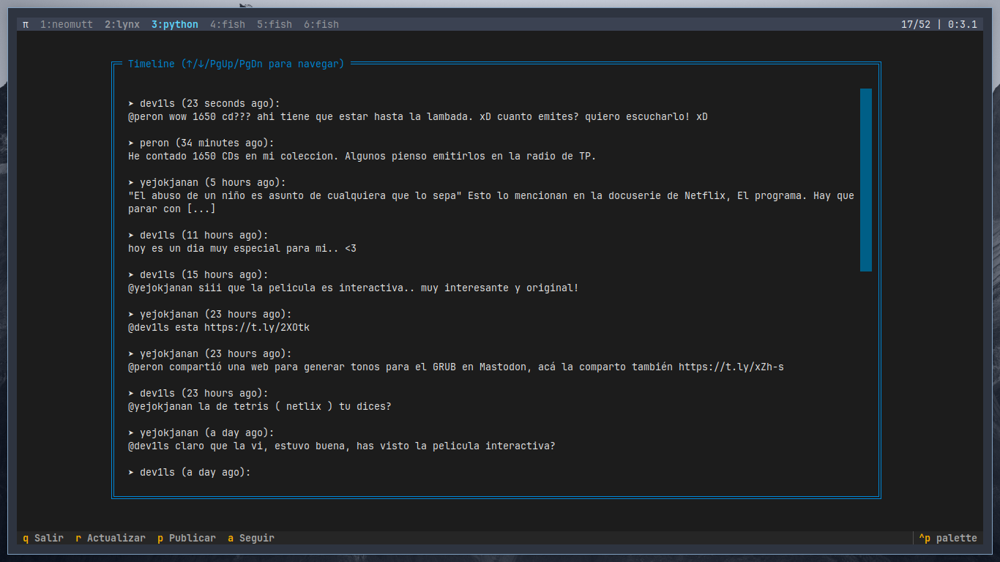

# Twtxt TUI
Una aplicación TUI (Text-User Interface) en Python para el manejo gráfico de twtxt es una herramienta de software que permite a los usuarios interactuar con un servicio de microblogging descentralizado basado en archivos de texto plano.

## wiki

Tabla de Contenidos

    Requisitos
    Instalación
    Configuración Inicial
    Uso Básico
    Solución de Problemas
    Personalización
Requisitos <a name="requisitos"></a>

    Python 3.8 o superior
    pip (gestor de paquetes Python)
    Terminal compatible con TUI (Terminal, Kitty, Alacritty, etc.)
Instalación <a name="instalación"></a>

## 1. Instalar dependencias

```bash

# Linux/macOS

python3 -m pip install --user twtxt textual

# Windows

py -m pip install twtxt textual
```

### 2. Configurar entorno

```bash

# Crear directorio para la aplicación

mkdir ~/twtxt-tui && cd ~/twtxt-tui

# Configurar twtxt (sigue las instrucciones)

twtxt config


```

### 3. Descargar la aplicación

bash
git clone https://github.com/dev1lsconf/twtxt_tui.git

Configuración Inicial

    Editar configuración de twtxt:
bash

nano ~/.config/twtxt/config.yml

    Asegurarte de tener al menos:
yaml

nick: tu_usuario

twturl: [URL](https://tu.servidor.twtxt)

Uso Básico <a name="uso-básico"></a>

bash

# Iniciar la aplicación

python3 twtxt_tui.py

Atajos principales:

- q: Salir
- r: Recargar timeline
- p: Publicar tweet
- a: Añadir seguidor
- ↑/↓: Navegar timeline
- PgUp/PgDn: Scroll rápido
Modo Vim:

- j: Bajar
- k: Subir
Solución de Problemas <a name="solución-de-problemas"></a>

Error: "twtxt no está instalado"

bash

python3 -m pip install --upgrade twtxt

Error: "Configuración no encontrada"

bash

twtxt config

Los tweets no se actualizan

bash

# Forzar actualización manual

twtxt timeline

Problemas con Textual

bash

# Actualizar framework

python3 -m pip install --upgrade textual

Personalización <a name="personalización"></a>

Notas

    Versión mínima testeada: Python 3.8
    Compatible con twtxt v1.3.0+
    Proyecto comunitario - ¡Contribuciones bienvenidas!
¡Listo! Un cliente twtxt completo con interfaz TUI. 🎉

