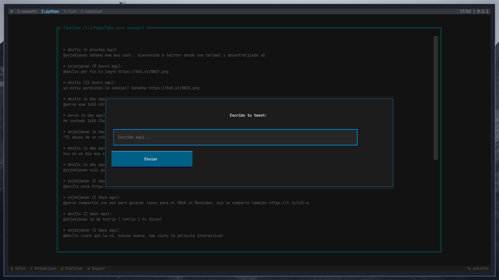

# Twtxt TUI
Una aplicación TUI (Text-User Interface) en Python para el manejo gráfico de twtxt es una herramienta de software que permite a los usuarios interactuar con un servicio de microblogging descentralizado basado en archivos de texto plano.

## wiki

Tabla de Contenidos

    Requisitos
    Instalación
    Configuración Inicial
    Uso Básico
    Solución de Problemas

    Python 3.8 o superior
    pip (gestor de paquetes Python)
    Terminal compatible con TUI (Terminal, Kitty, Alacritty, etc.)


## 1. Instalar dependencias

```bash

# Linux/macOS

python3 -m pip install --user twtxt textual

# Windows

py -m pip install twtxt textual
```

### 2. Configurar entorno

```bash

# Crear directorio para la aplicación

mkdir ~/twtxt-tui && cd ~/twtxt-tui

# Configurar twtxt (sigue las instrucciones)

twtxt config


```

### 3. Descargar la aplicación

```bash
git clone https://github.com/dev1lsconf/twtxt_tui.git

```

### Configuración Inicial

Editar configuración de twtxt:

```bash

nano ~/.config/twtxt/config

```

Asegurarte de tener al menos:

nick: tu_usuario

twturl: https://tu.servidor.twtxt


# Uso Basico

```bash
python3 twtxt_tui.py
```

Atajos principales:

- q: Salir
- r: Recargar timeline
- p: Publicar tweet
- a: Añadir seguidor
- ↑/↓: Navegar timeline
- PgUp/PgDn: Scroll rápido
Modo Vim:

- j: Bajar
- k: Subir

Error: "twtxt no está instalado"

```bash

python3 -m pip install --upgrade twtxt
```

Error: "Configuración no encontrada"

```bash

twtxt config
```

Los tweets no se actualizan


# Forzar actualización manual
```bash

twtxt timeline
```


# Actualizar framework

Problemas con Textual
```bash
python3 -m pip install --upgrade textual
```


Notas

    Versión mínima testeada: Python 3.8
    Compatible con twtxt v1.3.0+
    Proyecto comunitario - ¡Contribuciones bienvenidas!

